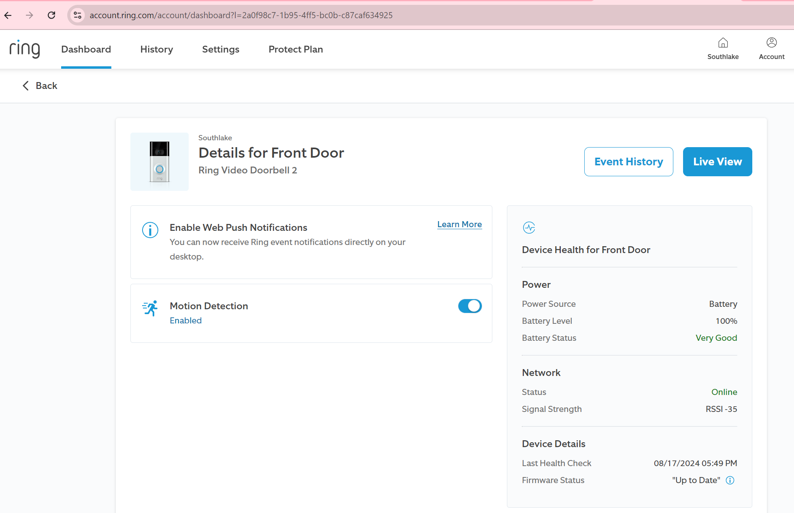
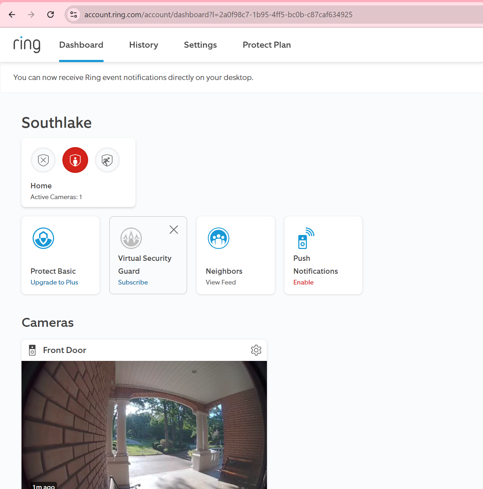

launch.json
```json
{
    // Use IntelliSense to learn about possible attributes.
    // Hover to view descriptions of existing attributes.
    // For more information, visit: https://go.microsoft.com/fwlink/?linkid=830387
    "version": "0.2.0",
    "configurations": [

        {
            "name": "Python Debugger: ring_doorbell/cli.py with Arguments",
            "type": "debugpy",
            "request": "launch",
            "program": "ring_doorbell/cli.py",
            "console": "integratedTerminal",
            "args": [
                "motion_detection", "--device-name", "Front Door" , "--off"
            ]
        }
    ]
}
```

No way to see and control chimes from browser.. will need to intercept the network traffic from mobile app



